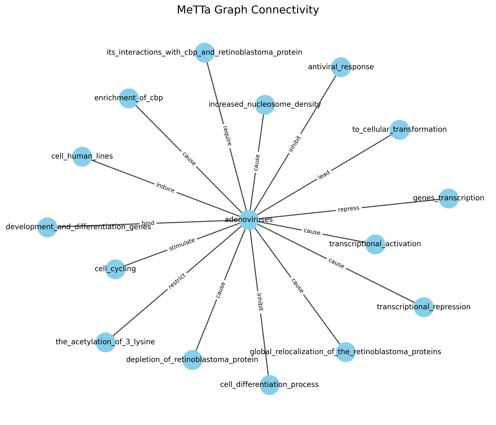

# MeTTa Graph Connectivity Analyzer



## 📌 Overview

A tool for analyzing and visualizing connectivity in MeTTa knowledge representations. Identifies connected components, orphan nodes, and provides interactive graph visualizations.

## ✨ Features

- **Graph Visualization** - Clear diagrams of relationship networks
- **Connectivity Analysis** - Finds connected components and orphan nodes
- **Flexible Parsing** - Handles various MeTTa syntax formats
- **Web Interface** - Browser-based interactive UI
- **Multiple Layouts** - Different visualization options

## 🛠️ Installation

### Prerequisites
- Python 3.8+
- pip

### Setup
```bash
git clone https://github.com/meron-23/metta-graph-connectivity-analyzer.git
cd metta-graph-analyzer

# Create virtual environment
python -m venv venv
source venv/bin/activate  # Linux/Mac
venv\Scripts\activate    # Windows

# Install dependencies
pip install -r requirements.txt

## Usage

### Web Application
```bash
python metta_analyzer.py